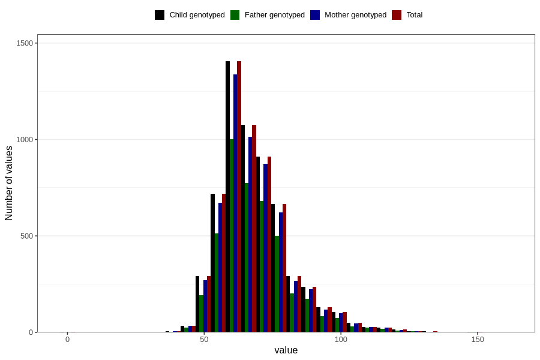

# mother_weight_before
Variable mapping to `MORS_VEKT_FOER` in `MFR_541_v12`.
- Number of values:

| Value | Total | Child genotyped | Mother genotyped | Father genotyped |
| ----- | ----- | --------------- | ---------------- | ---------------- |
| Missing | 74797 | 74797 | 70362 | 48842 |
| Non-missing | 6009 | 6009 | 5662 | 4321 |
| 25th percentile | 60 | 60 | 60 | 60 |
| 50th percentile | 66 | 66 | 66 | 66 |
| 75th percentile | 75 | 75 | 75 | 75 |
| Mean | 68.5322016974538 | 68.5322016974538 | 68.4682091133875 | 68.6118953945846 |
| Standard deviation | 13.305273244111 | 13.305273244111 | 13.1875293559528 | 13.1020403112906 |
| N | 6009 | 6009 | 5662 | 4321 |

