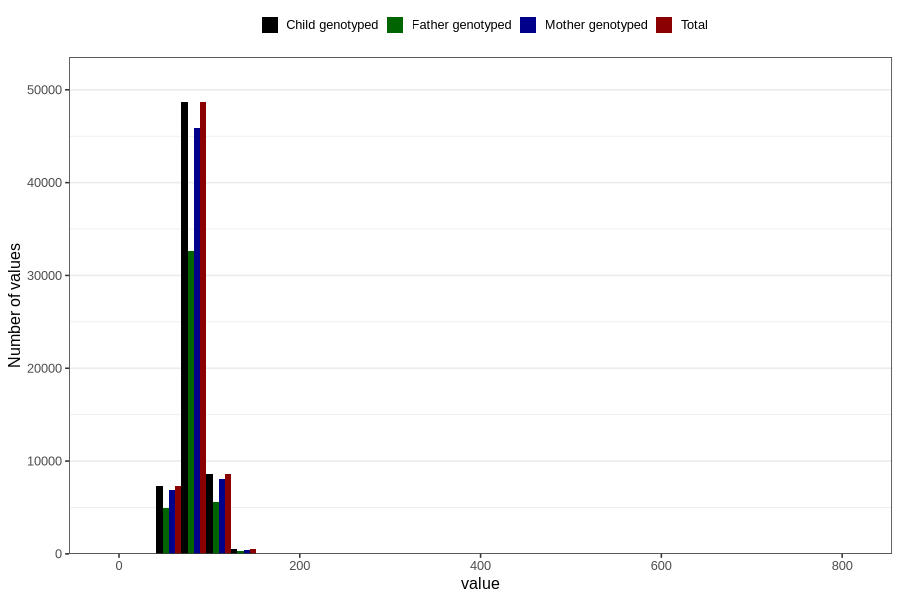

# mother_weight_end
Variable mapping to `MORS_VEKT_SLUTT` in `MFR_541_v12`.
Variable mapping to `MORS_VEKT_SLUTT` in `MFR_541_v12`.
- Number of values:

| Value | Total | Child genotyped | Mother genotyped | Father genotyped |
| ----- | ----- | --------------- | ---------------- | ---------------- |
| Missing | 15632 | 15632 | 14605 | 9609 |
| Non-missing | 65174 | 65174 | 61419 | 43554 |
| 25th percentile | 74 | 74 | 74 | 73.9 |
| 50th percentile | 81 | 81 | 81 | 81 |
| 75th percentile | 90 | 90 | 90 | 90 |
| Mean | 82.86562432872 | 82.86562432872 | 82.8276722186945 | 82.7973894475823 |
| Standard deviation | 14.1025000494585 | 14.1025000494585 | 14.1049431575377 | 13.990955379751 |
| N | 65174 | 65174 | 61419 | 43554 |

