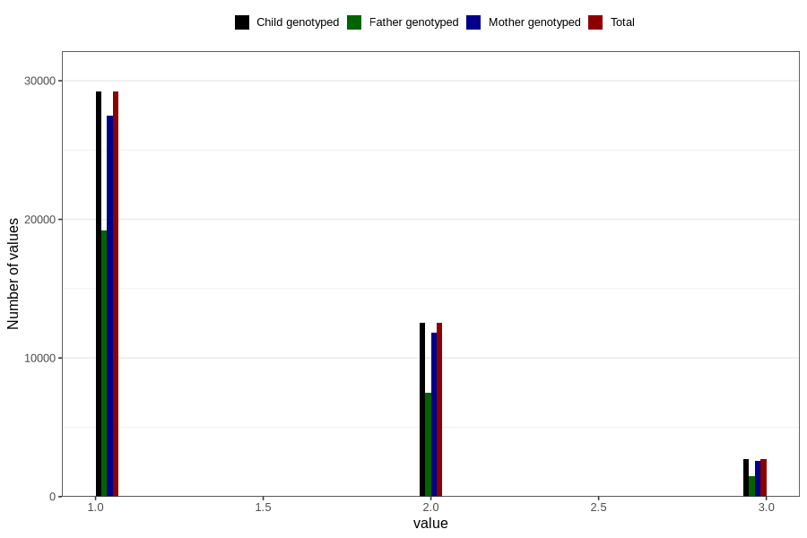

# n_previous_deliveries
Variable mapping to `PARITET_5` in `MFR_541_v12`.
- Number of values:

| Value | Total | Child genotyped | Mother genotyped | Father genotyped |
| ----- | ----- | --------------- | ---------------- | ---------------- |
| Missing | 66 | 66 | 61 | 44 |
| Non-missing | 80740 | 80740 | 75963 | 53119 |
| 0 (primiparous) | 35475 | 35475 | 33305 |24567 |
| 4 or more | 822 | 822 | 765 |403 |
| 1 | 29207 | 29207 | 27507 | 19179 |
| 2 | 12527 | 12527 | 11835 | 7485 |
| 3 | 2709 | 2709 | 2551 | 1485 |

