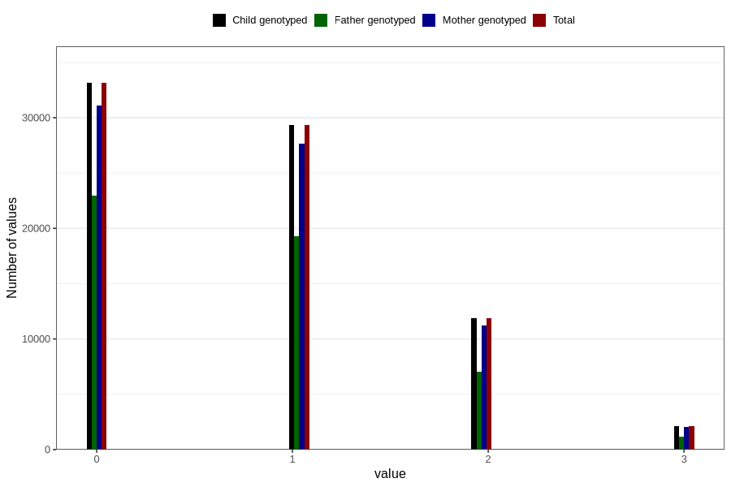

# n_previous_live_births
Variable mapping to `LEVENDEFODTE_5` in `MFR_541_v12`.
- Number of values:

| Value | Total | Child genotyped | Mother genotyped | Father genotyped |
| ----- | ----- | --------------- | ---------------- | ---------------- |
| Missing | 3740 | 3740 | 3536 | 2530 |
| Non-missing | 77066 | 77066 | 72488 | 50633 |
| 4 or more | 542 | 542 | 504 |244 |
| 0 | 33139 | 33139 | 31080 | 22944 |
| 1 | 29374 | 29374 | 27663 | 19278 |
| 2 | 11864 | 11864 | 11213 | 7018 |
| 3 | 2147 | 2147 | 2028 | 1149 |

