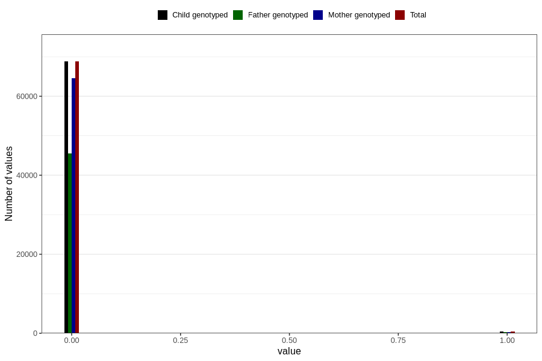

# n_previous_stillbirths
Variable mapping to `DODFODTE_3` in `MFR_541_v12`.
- Number of values:

| Value | Total | Child genotyped | Mother genotyped | Father genotyped |
| ----- | ----- | --------------- | ---------------- | ---------------- |
| Missing | 11624 | 11624 | 11020 | 7405 |
| Non-missing | 69182 | 69182 | 65004 | 45758 |
| 2 or more | 23 | 23 | 22 |11 |
| 0 | 68782 | 68782 | 64634 | 45535 |
| 1 | 377 | 377 | 348 | 212 |

