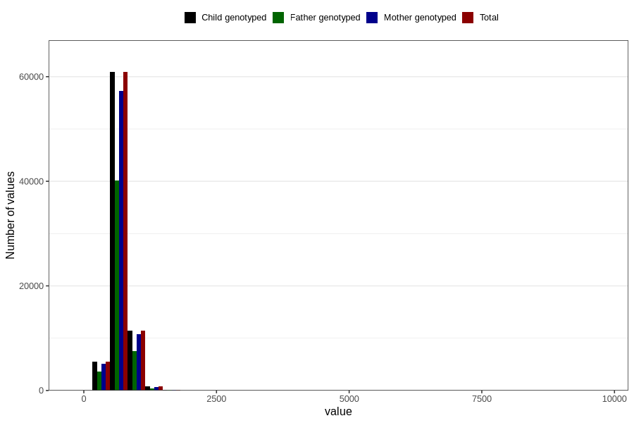

# placental_weight
Variable mapping to `PLACENTAVEKT` in `MFR_541_v12`.
- Number of values:

| Value | Total | Child genotyped | Mother genotyped | Father genotyped |
| ----- | ----- | --------------- | ---------------- | ---------------- |
| Missing | 2104 | 2104 | 1954 | 1353 |
| Non-missing | 78702 | 78702 | 74070 | 51810 |
| 25th percentile | 585 | 585 | 585 | 585 |
| 50th percentile | 670 | 670 | 670 | 670 |
| 75th percentile | 773 | 773 | 772 | 770 |
| Mean | 687.257299687428 | 687.257299687428 | 687.135749966248 | 686.484481760278 |
| Standard deviation | 179.948808339248 | 179.948808339248 | 181.261837418799 | 173.459372622341 |
| N | 78702 | 78702 | 74070 | 51810 |

