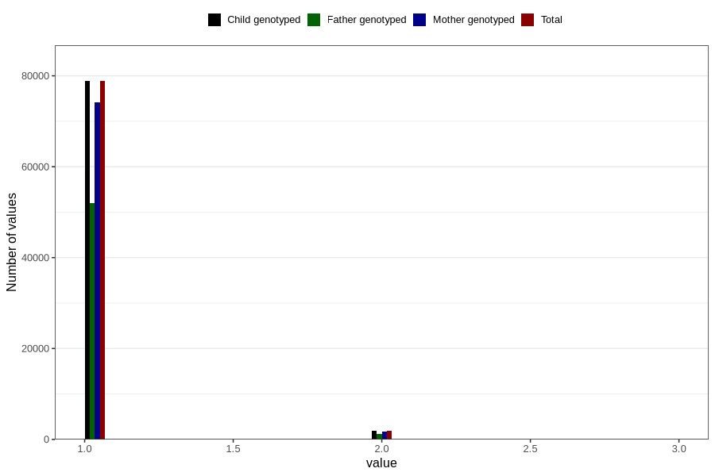

# plurality
Variable mapping to `PLURAL` in `MFR_541_v12`.
- Number of values:

| Value | Total | Child genotyped | Mother genotyped | Father genotyped |
| ----- | ----- | --------------- | ---------------- | ---------------- |
| Missing | 66 | 66 | 61 | 44 |
| Non-missing | 80740 | 80740 | 75963 | 53119 |
| 1 | 78826 | 78826 | 74148 | 51918 |
| 2 | 1895 | 1895 | 1796 | 1194 |
| 3 | 19 | 19 | 19 | 7 |

