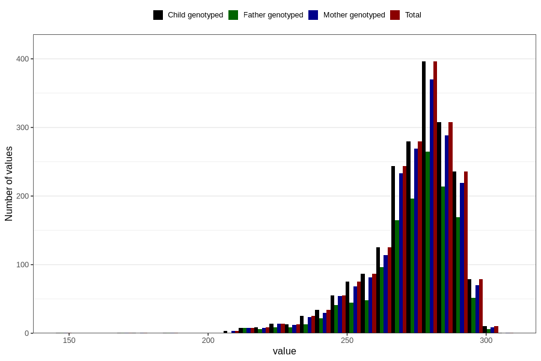

# pregnancy_duration_art
Variable mapping to `SVLEN_ART_DG` in `MFR_541_v12`.
- Number of values:

| Value | Total | Child genotyped | Mother genotyped | Father genotyped |
| ----- | ----- | --------------- | ---------------- | ---------------- |
| Missing | 78800 | 78800 | 74145 | 51796 |
| Non-missing | 2006 | 2006 | 1879 | 1367 |
| 25th percentile | 267 | 267 | 267 | 267 |
| 50th percentile | 277 | 277 | 277 | 277 |
| 75th percentile | 284 | 284 | 284 | 285 |
| Mean | 273.690428713858 | 273.690428713858 | 273.589143161256 | 273.907095830285 |
| Standard deviation | 16.0965409804967 | 16.0965409804967 | 16.1499367536273 | 16.0098158298783 |
| N | 2006 | 2006 | 1879 | 1367 |

