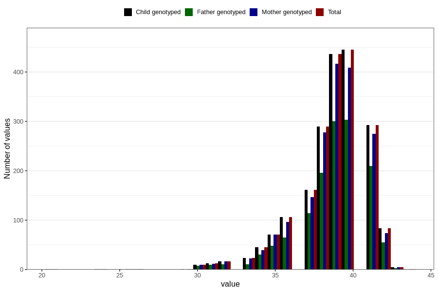

# pregnancy_duration_art_weeks
Variable mapping to `SVLEN_ART` in `MFR_541_v12`.
- Number of values:

| Value | Total | Child genotyped | Mother genotyped | Father genotyped |
| ----- | ----- | --------------- | ---------------- | ---------------- |
| Missing | 78800 | 78800 | 74145 | 51796 |
| Non-missing | 2006 | 2006 | 1879 | 1367 |
| 25th percentile | 38 | 38 | 38 | 38 |
| 50th percentile | 39 | 39 | 39 | 39 |
| 75th percentile | 40 | 40 | 40 | 40 |
| Mean | 38.6719840478564 | 38.6719840478564 | 38.6562001064396 | 38.7059253840527 |
| Standard deviation | 2.3170371380272 | 2.3170371380272 | 2.3250162055569 | 2.30598273457839 |
| N | 2006 | 2006 | 1879 | 1367 |

