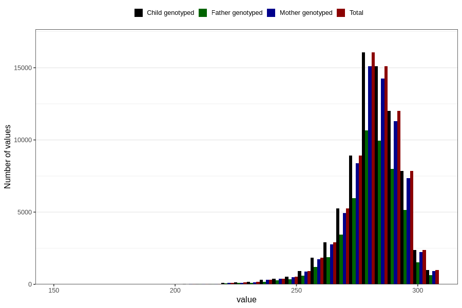

# pregnancy_duration_mens
Variable mapping to `SVLEN_SM_DG` in `MFR_541_v12`.
- Number of values:

| Value | Total | Child genotyped | Mother genotyped | Father genotyped |
| ----- | ----- | --------------- | ---------------- | ---------------- |
| Missing | 4745 | 4745 | 4433 | 3015 |
| Non-missing | 76061 | 76061 | 71591 | 50148 |
| 25th percentile | 275 | 275 | 275 | 275 |
| 50th percentile | 283 | 283 | 283 | 283 |
| 75th percentile | 289 | 289 | 289 | 289 |
| Mean | 281.129264669147 | 281.129264669147 | 281.135268399659 | 281.165689558906 |
| Standard deviation | 12.4441117521157 | 12.4441117521157 | 12.4438720645954 | 12.3356148436954 |
| N | 76061 | 76061 | 71591 | 50148 |

