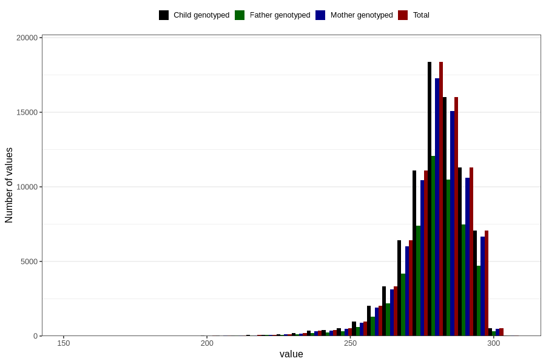

# pregnancy_duration_ultrasound
Variable mapping to `SVLEN_UL_DG` in `MFR_541_v12`.
- Number of values:

| Value | Total | Child genotyped | Mother genotyped | Father genotyped |
| ----- | ----- | --------------- | ---------------- | ---------------- |
| Missing | 1849 | 1849 | 1763 | 1210 |
| Non-missing | 78957 | 78957 | 74261 | 51953 |
| 25th percentile | 274 | 274 | 274 | 274 |
| 50th percentile | 281 | 281 | 281 | 281 |
| 75th percentile | 287 | 287 | 287 | 287 |
| Mean | 279.55442835974 | 279.55442835974 | 279.569033543852 | 279.603256789791 |
| Standard deviation | 11.6747745810948 | 11.6747745810948 | 11.6707625032926 | 11.6517553747776 |
| N | 78957 | 78957 | 74261 | 51953 |

