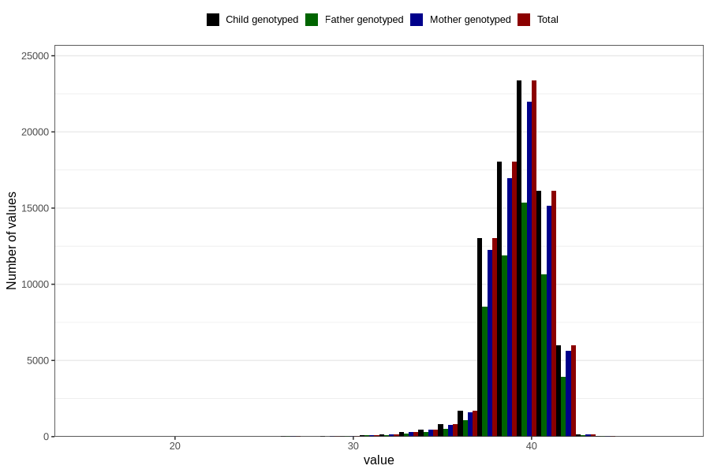

# pregnancy_duration_weeks
Variable mapping to `SVLEN` in `MFR_541_v12`.
- Number of values:

| Value | Total | Child genotyped | Mother genotyped | Father genotyped |
| ----- | ----- | --------------- | ---------------- | ---------------- |
| Missing | 363 | 363 | 349 | 234 |
| Non-missing | 80443 | 80443 | 75675 | 52929 |
| 25th percentile | 39 | 39 | 39 | 39 |
| 50th percentile | 40 | 40 | 40 | 40 |
| 75th percentile | 41 | 41 | 41 | 41 |
| Mean | 39.5133448528772 | 39.5133448528772 | 39.515242814668 | 39.5209809367266 |
| Standard deviation | 1.70980360335774 | 1.70980360335774 | 1.71025818260207 | 1.70800000927957 |
| N | 80443 | 80443 | 75675 | 52929 |

