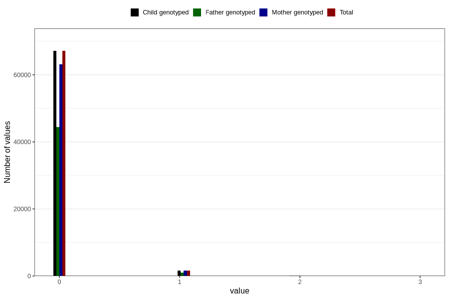

# previous_miscarriages_12_23w
Variable mapping to `SPABORT_23_5` in `MFR_541_v12`.
- Number of values:

| Value | Total | Child genotyped | Mother genotyped | Father genotyped |
| ----- | ----- | --------------- | ---------------- | ---------------- |
| Missing | 11803 | 11803 | 11183 | 7503 |
| Non-missing | 69003 | 69003 | 64841 | 45660 |
| 4 or more | 28 | 28 | 22 |18 |
| 0 | 67113 | 67113 | 63069 | 44451 |
| 1 | 1670 | 1670 | 1572 | 1063 |
| 2 | 157 | 157 | 148 | 103 |
| 3 | 35 | 35 | 30 | 25 |

