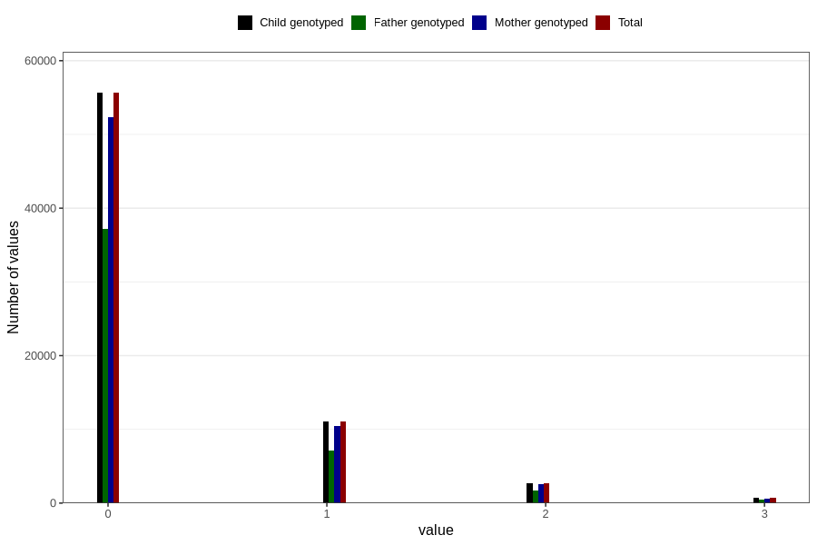

# previous_miscarriages_before_12w
Variable mapping to `SPABORT_12_5` in `MFR_541_v12`.
- Number of values:

| Value | Total | Child genotyped | Mother genotyped | Father genotyped |
| ----- | ----- | --------------- | ---------------- | ---------------- |
| Missing | 10278 | 10278 | 9733 | 6555 |
| Non-missing | 70528 | 70528 | 66291 | 46608 |
| 4 or more | 386 | 386 | 345 |223 |
| 0 | 55628 | 55628 | 52290 | 37137 |
| 1 | 11127 | 11127 | 10471 | 7135 |
| 2 | 2691 | 2691 | 2528 | 1688 |
| 3 | 696 | 696 | 657 | 425 |

