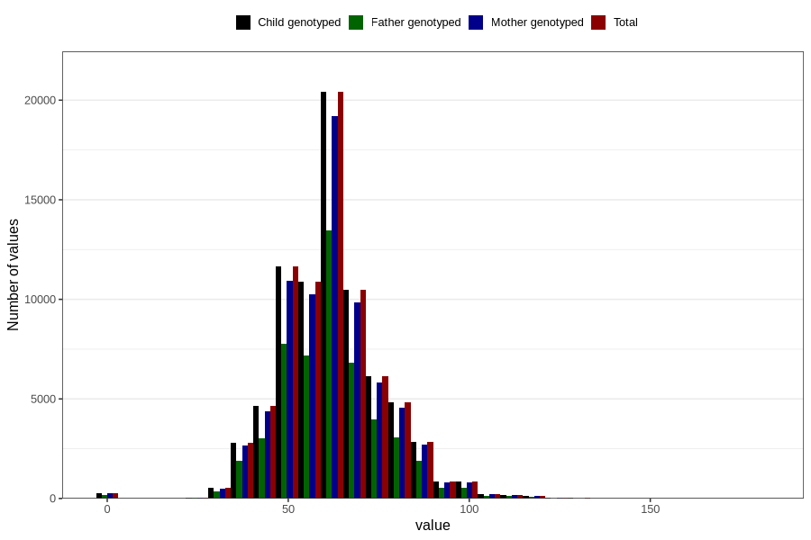

# umbilical_cord_length
Variable mapping to `NAVLESNORLENGDE` in `MFR_541_v12`.
- Number of values:

| Value | Total | Child genotyped | Mother genotyped | Father genotyped |
| ----- | ----- | --------------- | ---------------- | ---------------- |
| Missing | 2971 | 2971 | 2778 | 1989 |
| Non-missing | 77835 | 77835 | 73246 | 51174 |
| 25th percentile | 52 | 52 | 52 | 52 |
| 50th percentile | 60 | 60 | 60 | 60 |
| 75th percentile | 70 | 70 | 70 | 70 |
| Mean | 61.9536301149868 | 61.9536301149868 | 61.9803374928324 | 61.8476042521593 |
| Standard deviation | 14.1113543186239 | 14.1113543186239 | 14.1072297644687 | 14.121286023548 |
| N | 77835 | 77835 | 73246 | 51174 |

