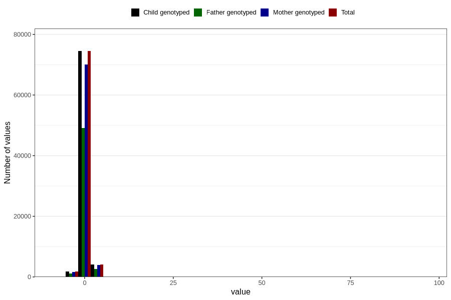

# weight_birth_z_ga
Variable mapping to `ZSCORE_BW_GA` in `MFR_541_v12`.
- Number of values:

| Value | Total | Child genotyped | Mother genotyped | Father genotyped |
| ----- | ----- | --------------- | ---------------- | ---------------- |
| Missing | 389 | 389 | 375 | 250 |
| Non-missing | 80417 | 80417 | 75649 | 52913 |
| 25th percentile | -0.54 | -0.54 | -0.54 | -0.54 |
| 50th percentile | 0.09 | 0.09 | 0.09 | 0.08 |
| 75th percentile | 0.74 | 0.74 | 0.74 | 0.74 |
| Mean | 0.12896290585324 | 0.12896290585324 | 0.128430646802998 | 0.123810405760399 |
| Standard deviation | 1.07730414502162 | 1.07730414502162 | 1.08291098768758 | 1.05981141225728 |
| N | 80417 | 80417 | 75649 | 52913 |

