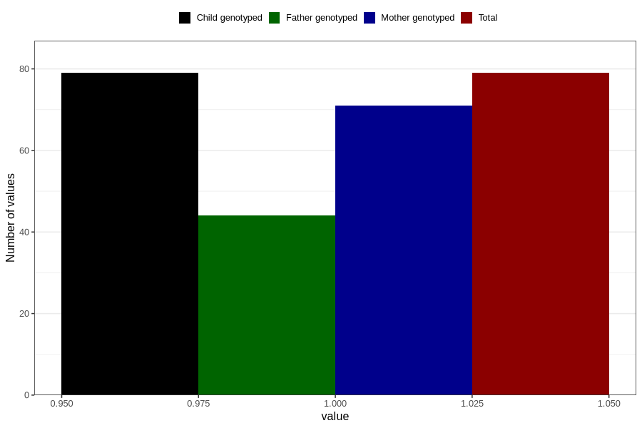

# amphetamine_before
Variable mapping to `AA1438` in `Skjema1_v12`.
- Number of values:

| Value | Total | Child genotyped | Mother genotyped | Father genotyped |
| ----- | ----- | --------------- | ---------------- | ---------------- |
| Missing | 80727 | 80727 | 75953 | 53119 |
| Non-missing | 79 | 79 | 71 | 44 |
| 1 | 79 | 79 | 71 | 44 |

