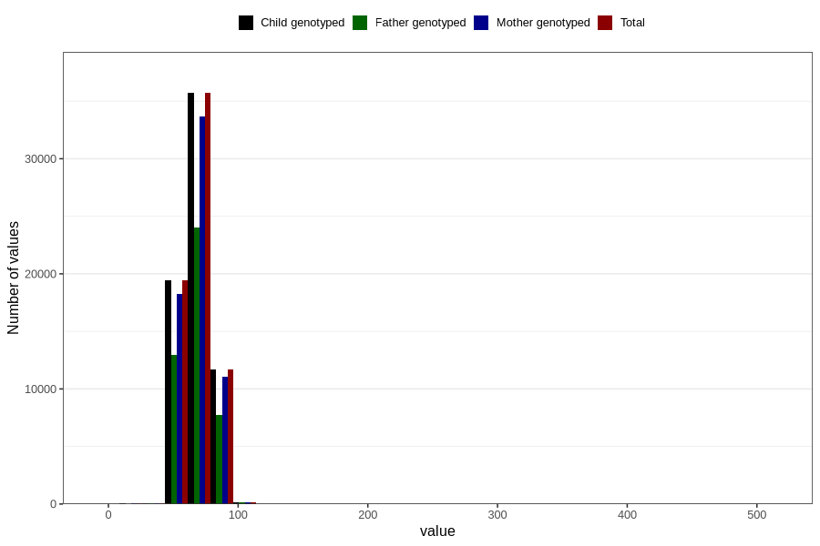

# blood_pressure_15w_diastolic
Variable mapping to `AA84` in `Skjema1_v12`.
- Number of values:

| Value | Total | Child genotyped | Mother genotyped | Father genotyped |
| ----- | ----- | --------------- | ---------------- | ---------------- |
| Missing | 13577 | 13577 | 12698 | 8202 |
| Non-missing | 67229 | 67229 | 63326 | 44961 |
| 25th percentile | 60 | 60 | 60 | 60 |
| 50th percentile | 70 | 70 | 70 | 70 |
| 75th percentile | 75 | 75 | 75 | 75 |
| Mean | 68.6991328147079 | 68.6991328147079 | 68.7076714145849 | 68.6858610796023 |
| Standard deviation | 9.38617156076655 | 9.38617156076655 | 9.37869877615977 | 9.42390518421123 |
| N | 67229 | 67229 | 63326 | 44961 |

