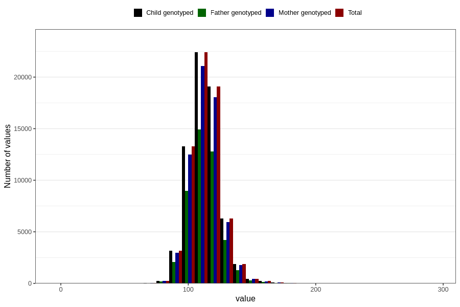

# blood_pressure_15w_systolic
Variable mapping to `AA83` in `Skjema1_v12`.
- Number of values:

| Value | Total | Child genotyped | Mother genotyped | Father genotyped |
| ----- | ----- | --------------- | ---------------- | ---------------- |
| Missing | 13514 | 13514 | 12637 | 8155 |
| Non-missing | 67292 | 67292 | 63387 | 45008 |
| 25th percentile | 106 | 106 | 106 | 106 |
| 50th percentile | 112 | 112 | 112 | 112 |
| 75th percentile | 120 | 120 | 120 | 120 |
| Mean | 114.023464899245 | 114.023464899245 | 114.053480997681 | 114.054768041237 |
| Standard deviation | 12.1748992767637 | 12.1748992767637 | 12.1665732900836 | 12.1284681625033 |
| N | 67292 | 67292 | 63387 | 45008 |

