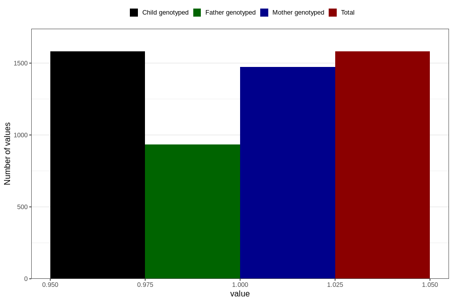

# depression_during_pregnancy_15w
Variable mapping to `AA870` in `Skjema1_v12`.
- Number of values:

| Value | Total | Child genotyped | Mother genotyped | Father genotyped |
| ----- | ----- | --------------- | ---------------- | ---------------- |
| Missing | 79225 | 79225 | 74551 | 52228 |
| Non-missing | 1581 | 1581 | 1473 | 935 |
| 1 | 1581 | 1581 | 1473 | 935 |

