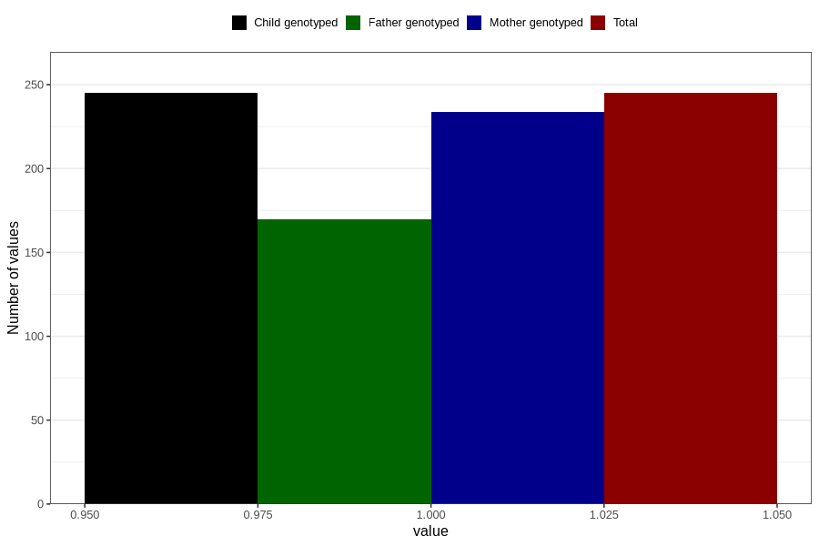

# diabetes_insulin_before
Variable mapping to `AA509` in `Skjema1_v12`.
- Number of values:

| Value | Total | Child genotyped | Mother genotyped | Father genotyped |
| ----- | ----- | --------------- | ---------------- | ---------------- |
| Missing | 80561 | 80561 | 75790 | 52993 |
| Non-missing | 245 | 245 | 234 | 170 |
| 1 | 245 | 245 | 234 | 170 |

