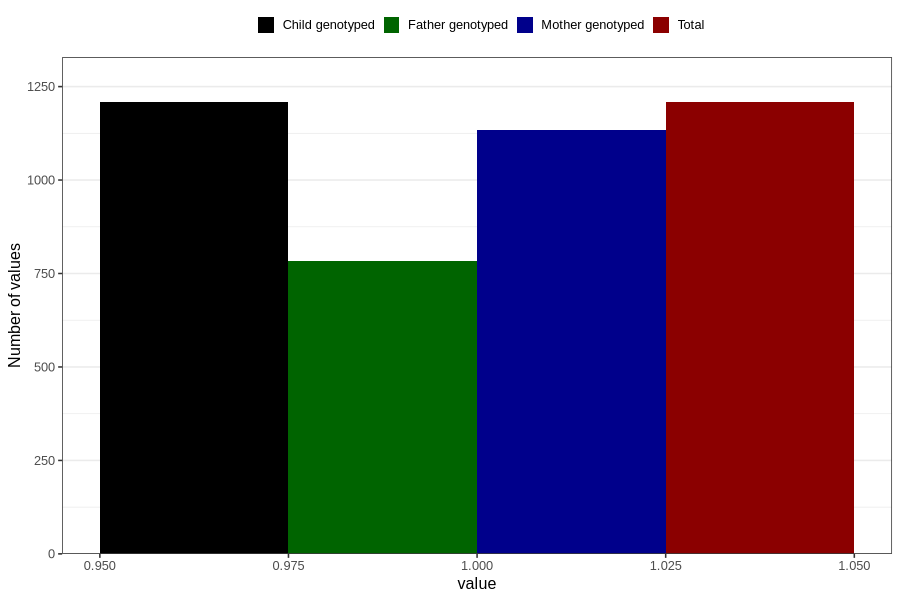

# endometriosis_before
Variable mapping to `AA689` in `Skjema1_v12`.
- Number of values:

| Value | Total | Child genotyped | Mother genotyped | Father genotyped |
| ----- | ----- | --------------- | ---------------- | ---------------- |
| Missing | 79598 | 79598 | 74891 | 52380 |
| Non-missing | 1208 | 1208 | 1133 | 783 |
| 1 | 1208 | 1208 | 1133 | 783 |

