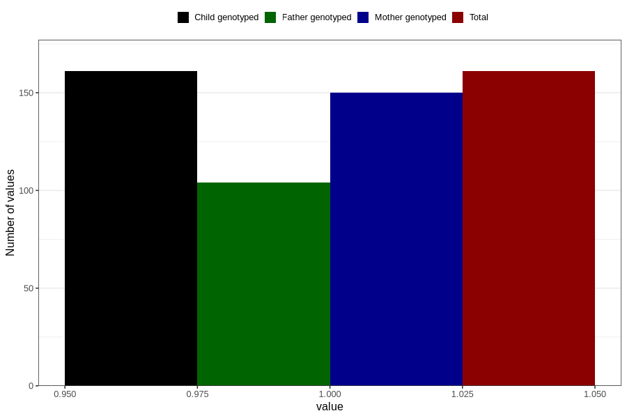

# endometriosis_during
Variable mapping to `AA690` in `Skjema1_v12`.
- Number of values:

| Value | Total | Child genotyped | Mother genotyped | Father genotyped |
| ----- | ----- | --------------- | ---------------- | ---------------- |
| Missing | 80645 | 80645 | 75874 | 53059 |
| Non-missing | 161 | 161 | 150 | 104 |
| 1 | 161 | 161 | 150 | 104 |

