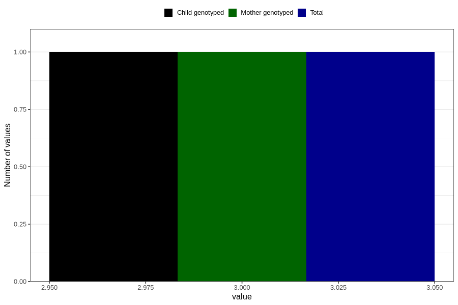

# ever_had_lack_of_energy_before_pregnancy
Variable mapping to `AA1574` in `Skjema1_v12`.
- Number of values:

| Value | Total | Child genotyped | Mother genotyped | Father genotyped |
| ----- | ----- | --------------- | ---------------- | ---------------- |
| Missing | 5620 | 5620 | 5246 | 3202 |
| Non-missing | 75186 | 75186 | 70778 | 49961 |
| More than 1 check box filled in | 12 | 12 | 10 |9 |
| No | 34509 | 34509 | 32617 |23404 |
| Yes | 40664 | 40664 | 38150 |26548 |
| 3 | 1 | 1 | 1 | 0 |

