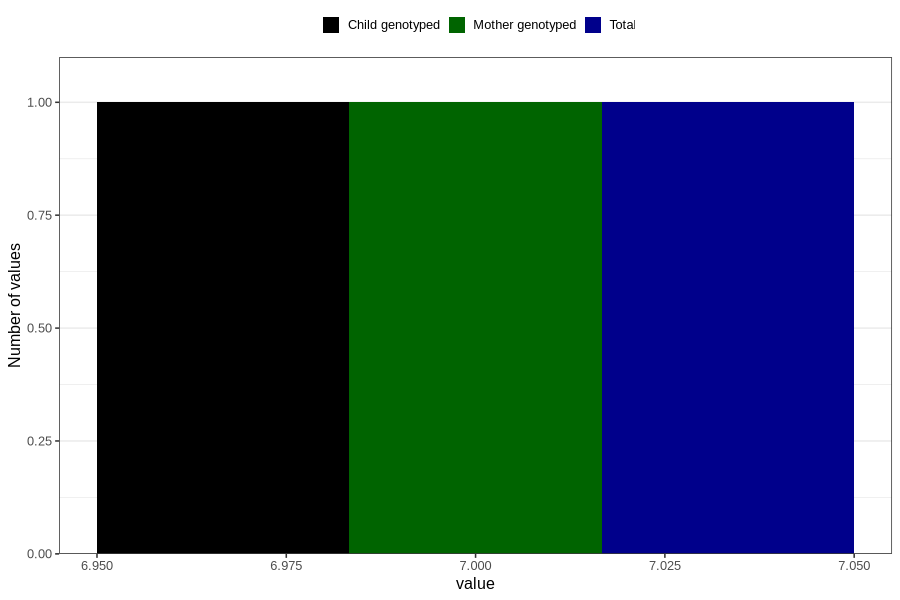

# frequently_disagree_with_partner_on_important_decisions_15w
Variable mapping to `AA1538` in `Skjema1_v12`.
- Number of values:

| Value | Total | Child genotyped | Mother genotyped | Father genotyped |
| ----- | ----- | --------------- | ---------------- | ---------------- |
| Missing | 8467 | 8467 | 7954 | 3804 |
| Non-missing | 72339 | 72339 | 68070 | 49359 |
| (1+2) | 1 | 1 | 1 |1 |
| (1+4) | 1 | 1 | 1 |1 |
| (1+6) | 2 | 2 | 2 |2 |
| (2+3) | 5 | 5 | 4 |5 |
| (2+4) | 2 | 2 | 1 |0 |
| (2+5) | 6 | 6 | 5 |5 |
| (2+6) | 7 | 7 | 7 |3 |
| (3+4) | 7 | 7 | 7 |7 |
| (3+5) | 2 | 2 | 2 |2 |
| (4+5) | 4 | 4 | 4 |2 |
| (5+6) | 3 | 3 | 3 |1 |
| Agree | 2514 | 2514 | 2346 |1523 |
| Agree somewhat | 6744 | 6744 | 6347 |4129 |
| Disagree | 31337 | 31337 | 29518 |21537 |
| Disagree somewhat | 7450 | 7450 | 6993 |4751 |
| More than 1 check box filled in | 3 | 3 | 3 |3 |
| Strongly agree | 914 | 914 | 848 |575 |
| Strongly disagree | 23336 | 23336 | 21977 |16812 |
| 7 | 1 | 1 | 1 | 0 |

