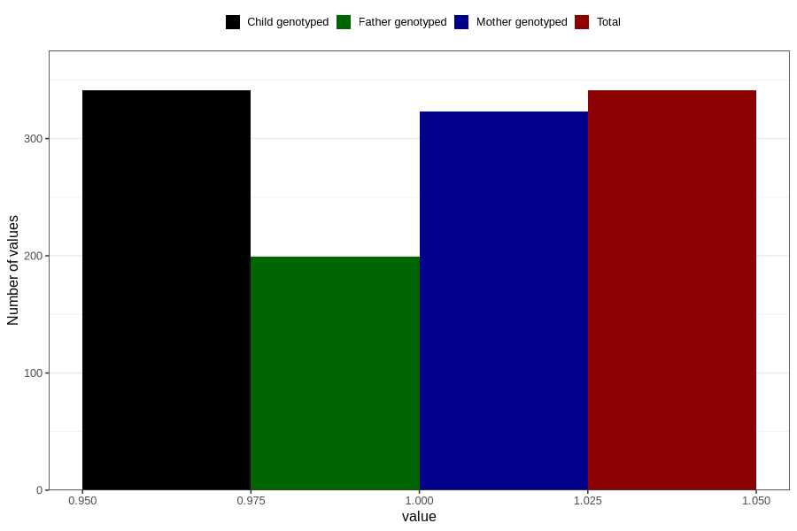

# hash_before
Variable mapping to `AA1434` in `Skjema1_v12`.
- Number of values:

| Value | Total | Child genotyped | Mother genotyped | Father genotyped |
| ----- | ----- | --------------- | ---------------- | ---------------- |
| Missing | 80465 | 80465 | 75701 | 52964 |
| Non-missing | 341 | 341 | 323 | 199 |
| 1 | 341 | 341 | 323 | 199 |

