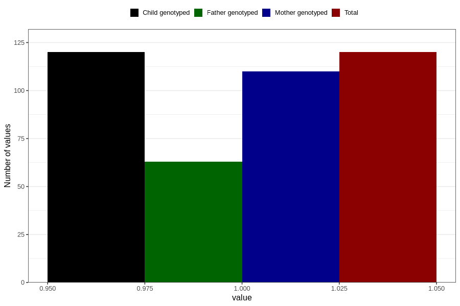

# hash_during
Variable mapping to `AA1435` in `Skjema1_v12`.
- Number of values:

| Value | Total | Child genotyped | Mother genotyped | Father genotyped |
| ----- | ----- | --------------- | ---------------- | ---------------- |
| Missing | 80686 | 80686 | 75914 | 53100 |
| Non-missing | 120 | 120 | 110 | 63 |
| 1 | 120 | 120 | 110 | 63 |

