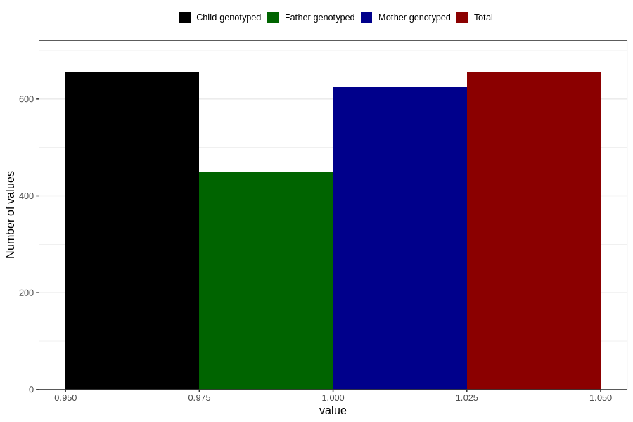

# high_cholesterol_before
Variable mapping to `AA545` in `Skjema1_v12`.
- Number of values:

| Value | Total | Child genotyped | Mother genotyped | Father genotyped |
| ----- | ----- | --------------- | ---------------- | ---------------- |
| Missing | 80150 | 80150 | 75398 | 52713 |
| Non-missing | 656 | 656 | 626 | 450 |
| 1 | 656 | 656 | 626 | 450 |

