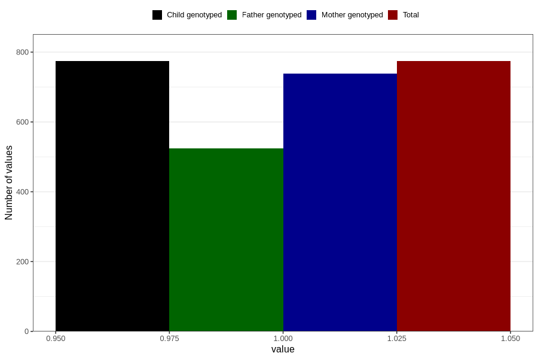

# highest_blood_pressure_before_pregnancy
Variable mapping to `AA554` in `Skjema1_v12`.
- Number of values:

| Value | Total | Child genotyped | Mother genotyped | Father genotyped |
| ----- | ----- | --------------- | ---------------- | ---------------- |
| Missing | 80032 | 80032 | 75286 | 52639 |
| Non-missing | 774 | 774 | 738 | 524 |
| 1 | 774 | 774 | 738 | 524 |

