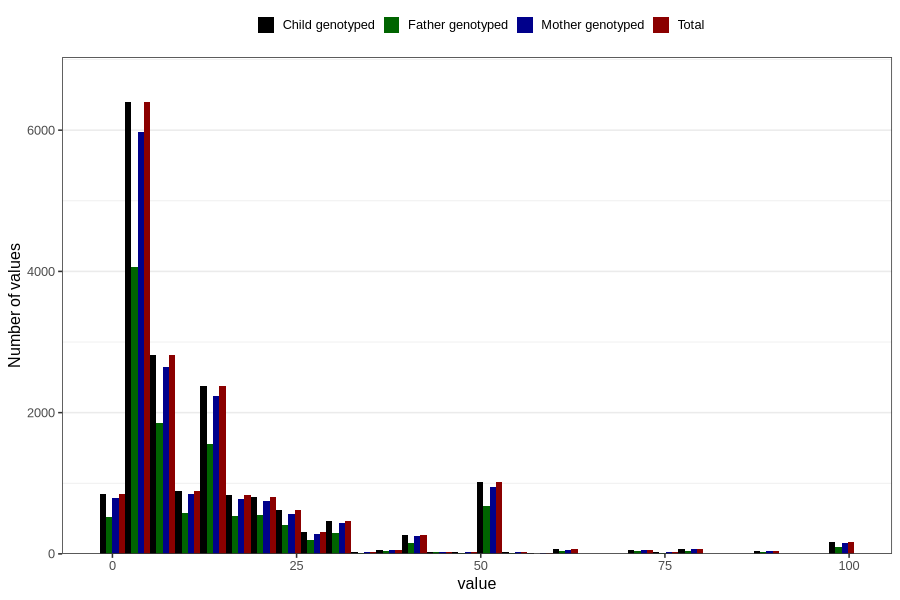

# three_lth_md_duration_before_pregnancy
Variable mapping to `AA1578` in `Skjema1_v12`.
- Number of values:

| Value | Total | Child genotyped | Mother genotyped | Father genotyped |
| ----- | ----- | --------------- | ---------------- | ---------------- |
| Missing | 62555 | 62555 | 58966 | 41379 |
| Non-missing | 18251 | 18251 | 17058 | 11784 |
| 25th percentile | 4 | 4 | 4 | 4 |
| 50th percentile | 8 | 8 | 8 | 8 |
| 75th percentile | 16 | 16 | 16 | 16 |
| Mean | 13.9185250123281 | 13.9185250123281 | 13.8751319029195 | 14.0176510522743 |
| Standard deviation | 16.990578931324 | 16.990578931324 | 16.918986309126 | 16.9629955263393 |
| N | 18251 | 18251 | 17058 | 11784 |

