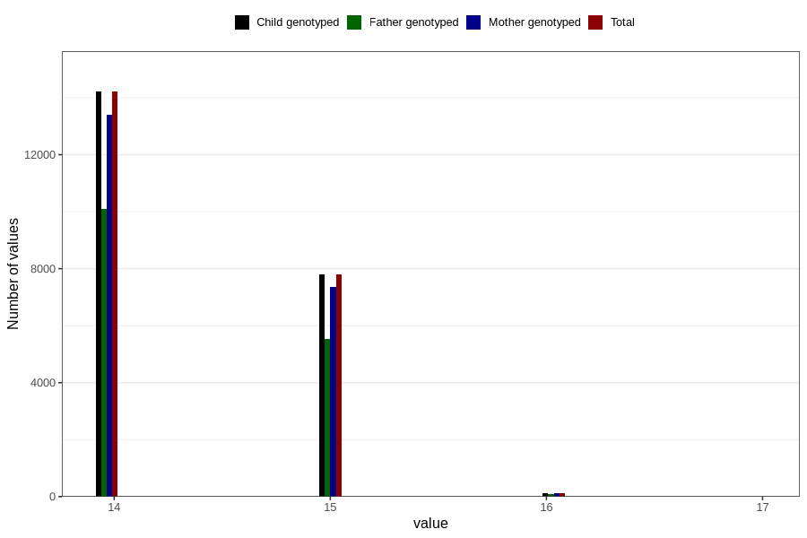

# age_answering_q_14m
Variable mapping to `AGE_YRS_UM` in `Ungdomsskjema_Mor_v12_standard`.
- Number of values:

| Value | Total | Child genotyped | Mother genotyped | Father genotyped |
| ----- | ----- | --------------- | ---------------- | ---------------- |
| Missing | 58654 | 58654 | 55155 | 37430 |
| Non-missing | 22152 | 22152 | 20869 | 15733 |
| 14 | 14210 | 14210 | 13390 | 10112 |
| 15 | 7806 | 7806 | 7352 | 5530 |
| 16 | 134 | 134 | 125 | 89 |
| 17 | 2 | 2 | 2 | 2 |

