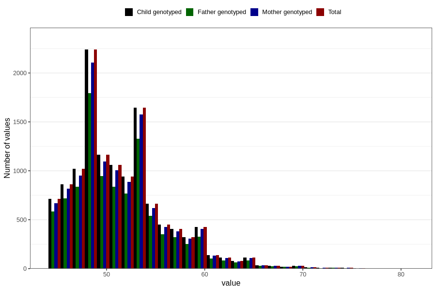

# age_answering_q_45f
Variable mapping to `AGE_YRS_LF` in `MobaForeldre45_Far_v12_standard`.
- Number of values:

| Value | Total | Child genotyped | Mother genotyped | Father genotyped |
| ----- | ----- | --------------- | ---------------- | ---------------- |
| Missing | 68289 | 68289 | 64204 | 43102 |
| Non-missing | 12517 | 12517 | 11820 | 10061 |
| 25th percentile | 48 | 48 | 48 | 48 |
| 50th percentile | 51 | 51 | 51 | 51 |
| 75th percentile | 54 | 54 | 54 | 54 |
| Mean | 51.5405448589918 | 51.5405448589918 | 51.5538917089679 | 51.4602922174734 |
| Standard deviation | 4.75793624309841 | 4.75793624309841 | 4.76203034300285 | 4.71073165418933 |
| N | 12517 | 12517 | 11820 | 10061 |

