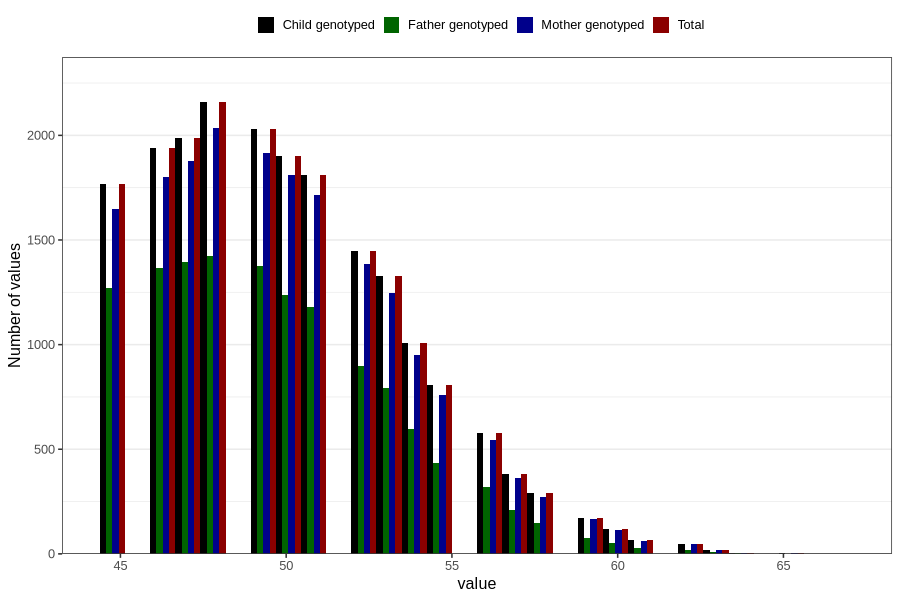

# age_answering_q_45m
Variable mapping to `AGE_YRS_LM` in `MobaForeldre45_Mor_v12_standard`.
- Number of values:

| Value | Total | Child genotyped | Mother genotyped | Father genotyped |
| ----- | ----- | --------------- | ---------------- | ---------------- |
| Missing | 60945 | 60945 | 57286 | 40341 |
| Non-missing | 19861 | 19861 | 18738 | 12822 |
| 25th percentile | 47 | 47 | 47 | 47 |
| 50th percentile | 50 | 50 | 50 | 49 |
| 75th percentile | 52 | 52 | 52 | 52 |
| Mean | 50.0360505513318 | 50.0360505513318 | 50.0540612658768 | 49.6989549212291 |
| Standard deviation | 3.64421065380246 | 3.64421065380246 | 3.64561480893066 | 3.47731532396084 |
| N | 19861 | 19861 | 18738 | 12822 |

