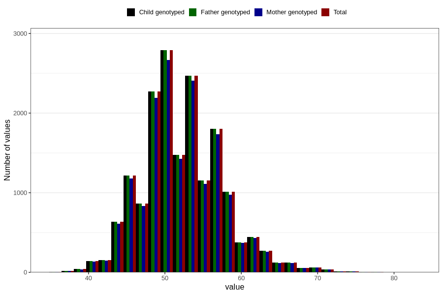

# age_answering_q_hf
Variable mapping to `AGE_YRS_HF` in `HelseFedre`.
- Number of values:

| Value | Total | Child genotyped | Mother genotyped | Father genotyped |
| ----- | ----- | --------------- | ---------------- | ---------------- |
| Missing | 63229 | 63229 | 59066 | 35586 |
| Non-missing | 17577 | 17577 | 16958 | 17577 |
| 25th percentile | 49 | 49 | 49 | 49 |
| 50th percentile | 52 | 52 | 52 | 52 |
| 75th percentile | 55 | 55 | 55 | 55 |
| Mean | 52.2980599647266 | 52.2980599647266 | 52.3196721311475 | 52.2980599647266 |
| Standard deviation | 5.34246746092583 | 5.34246746092583 | 5.35408973580399 | 5.34246746092583 |
| N | 17577 | 17577 | 16958 | 17577 |

