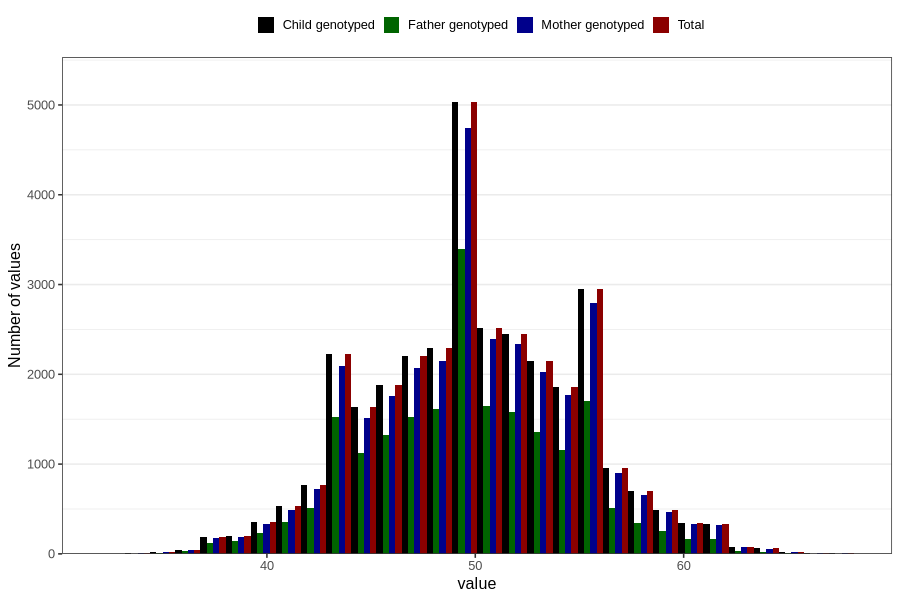

# age_answering_q_hm
Variable mapping to `AGE_YRS_HM` in `HelseModre`.
- Number of values:

| Value | Total | Child genotyped | Mother genotyped | Father genotyped |
| ----- | ----- | --------------- | ---------------- | ---------------- |
| Missing | 48511 | 48511 | 45557 | 32297 |
| Non-missing | 32295 | 32295 | 30467 | 20866 |
| 25th percentile | 47 | 47 | 47 | 46 |
| 50th percentile | 50 | 50 | 50 | 50 |
| 75th percentile | 53 | 53 | 53 | 53 |
| Mean | 49.996098467255 | 49.996098467255 | 50.0280631502938 | 49.6426722898495 |
| Standard deviation | 4.92425914459058 | 4.92425914459058 | 4.92368400188452 | 4.73641568883391 |
| N | 32295 | 32295 | 30467 | 20866 |

