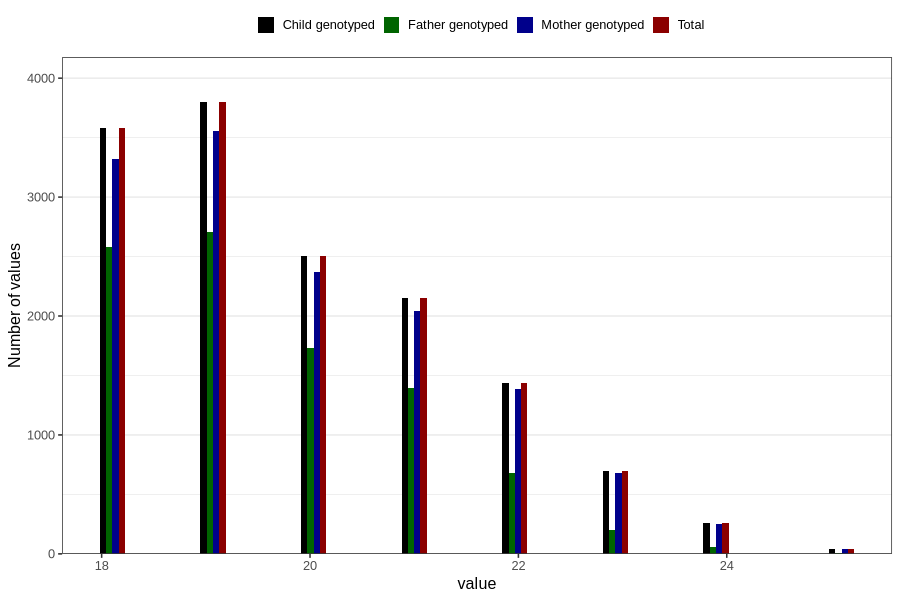

# age_answering_q_ung
Variable mapping to `AGE_YRS_UH` in `UngHelse_standard`.
- Number of values:

| Value | Total | Child genotyped | Mother genotyped | Father genotyped |
| ----- | ----- | --------------- | ---------------- | ---------------- |
| Missing | 66336 | 66336 | 62378 | 43796 |
| Non-missing | 14470 | 14470 | 13646 | 9367 |
| 18 | 3582 | 3582 | 3323 | 2582 |
| 19 | 3797 | 3797 | 3556 | 2709 |
| 20 | 2507 | 2507 | 2371 | 1733 |
| 21 | 2152 | 2152 | 2046 | 1396 |
| 22 | 1435 | 1435 | 1387 | 682 |
| 23 | 700 | 700 | 676 | 198 |
| 24 | 260 | 260 | 250 | 61 |
| 25 | 37 | 37 | 37 | 6 |

