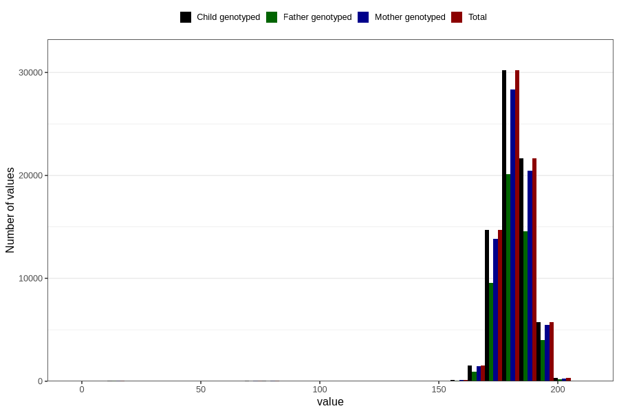

# father_height_15w
Variable mapping to `AA88` in `Skjema1_v12`.
- Number of values:

| Value | Total | Child genotyped | Mother genotyped | Father genotyped |
| ----- | ----- | --------------- | ---------------- | ---------------- |
| Missing | 6301 | 6301 | 5878 | 3534 |
| Non-missing | 74505 | 74505 | 70146 | 49629 |
| 25th percentile | 178 | 178 | 178 | 178 |
| 50th percentile | 181 | 181 | 181 | 182 |
| 75th percentile | 186 | 186 | 186 | 186 |
| Mean | 181.231917320985 | 181.231917320985 | 181.262395574944 | 181.408873843922 |
| Standard deviation | 9.68155568128315 | 9.68155568128315 | 9.59326392668788 | 9.46567478805289 |
| N | 74505 | 74505 | 70146 | 49629 |

