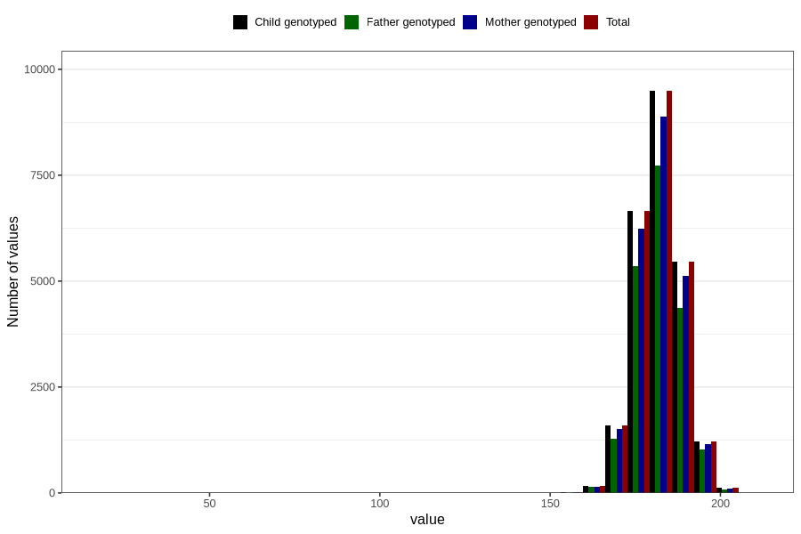

# father_height_self_15w
Variable mapping to `FF333` in `SkjemaFar_v12`.
- Number of values:

| Value | Total | Child genotyped | Mother genotyped | Father genotyped |
| ----- | ----- | --------------- | ---------------- | ---------------- |
| Missing | 56097 | 56097 | 52846 | 33190 |
| Non-missing | 24709 | 24709 | 23178 | 19973 |
| 25th percentile | 178 | 178 | 178 | 178 |
| 50th percentile | 182 | 182 | 182 | 182 |
| 75th percentile | 186 | 186 | 186 | 186 |
| Mean | 181.784005827836 | 181.784005827836 | 181.797480369316 | 181.824463025084 |
| Standard deviation | 6.76027521579769 | 6.76027521579769 | 6.77293817958523 | 6.73381841178252 |
| N | 24709 | 24709 | 23178 | 19973 |

