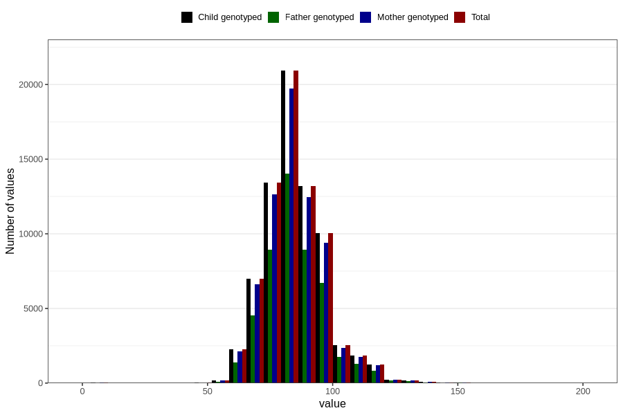

# father_weight_15w
Variable mapping to `AA89` in `Skjema1_v12`.
- Number of values:

| Value | Total | Child genotyped | Mother genotyped | Father genotyped |
| ----- | ----- | --------------- | ---------------- | ---------------- |
| Missing | 7472 | 7472 | 6976 | 4228 |
| Non-missing | 73334 | 73334 | 69048 | 48935 |
| 25th percentile | 77 | 77 | 77 | 77 |
| 50th percentile | 84 | 84 | 84 | 84 |
| 75th percentile | 92 | 92 | 92 | 92 |
| Mean | 85.1759347642294 | 85.1759347642294 | 85.1527777777778 | 85.3584959640339 |
| Standard deviation | 12.292229505579 | 12.292229505579 | 12.2626851181913 | 12.2114849331416 |
| N | 73334 | 73334 | 69048 | 48935 |

