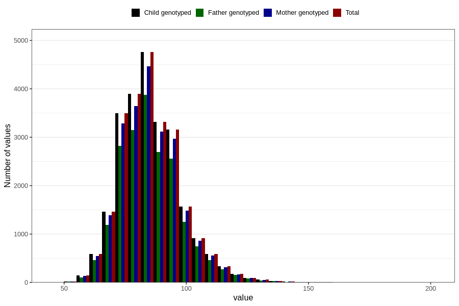

# father_weight_self_15w
Variable mapping to `FF334` in `SkjemaFar_v12`.
- Number of values:

| Value | Total | Child genotyped | Mother genotyped | Father genotyped |
| ----- | ----- | --------------- | ---------------- | ---------------- |
| Missing | 56127 | 56127 | 52872 | 33213 |
| Non-missing | 24679 | 24679 | 23152 | 19950 |
| 25th percentile | 77 | 77 | 77 | 77 |
| 50th percentile | 85 | 85 | 85 | 85 |
| 75th percentile | 93 | 93 | 93 | 93 |
| Mean | 85.7756959358159 | 85.7756959358159 | 85.7477669315826 | 85.7836992481203 |
| Standard deviation | 12.5577729384154 | 12.5577729384154 | 12.475431074015 | 12.4717853893623 |
| N | 24679 | 24679 | 23152 | 19950 |

