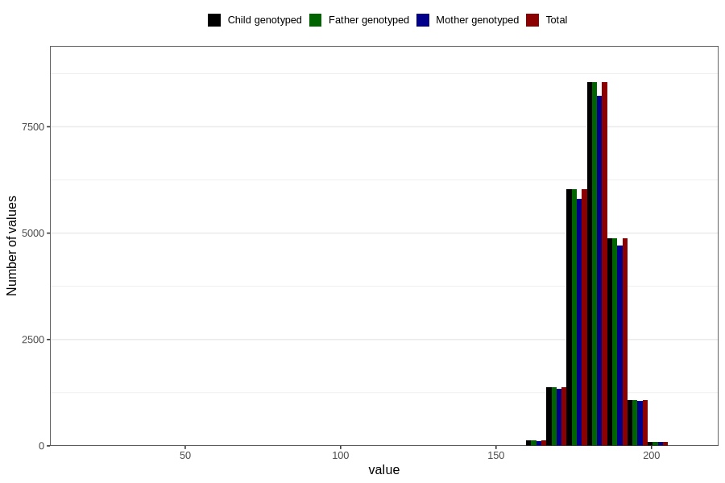

# height_father15
Variable mapping to `G__5` in `Far2_V12`.
- Number of values:

| Value | Total | Child genotyped | Mother genotyped | Father genotyped |
| ----- | ----- | --------------- | ---------------- | ---------------- |
| Missing | 58643 | 58643 | 54649 | 31000 |
| Non-missing | 22163 | 22163 | 21375 | 22163 |
| 25th percentile | 178 | 178 | 178 | 178 |
| 50th percentile | 182 | 182 | 182 | 182 |
| 75th percentile | 186 | 186 | 186 | 186 |
| Mean | 181.815006993638 | 181.815006993638 | 181.829801169591 | 181.815006993638 |
| Standard deviation | 6.77092903826631 | 6.77092903826631 | 6.78791114082936 | 6.77092903826631 |
| N | 22163 | 22163 | 21375 | 22163 |

