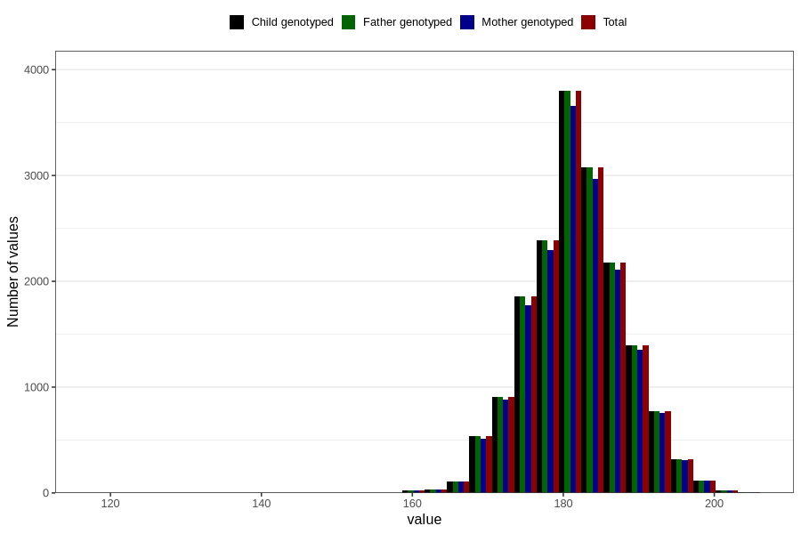

# height_hf
Variable mapping to `HF127` in `HelseFedre`.
- Number of values:

| Value | Total | Child genotyped | Mother genotyped | Father genotyped |
| ----- | ----- | --------------- | ---------------- | ---------------- |
| Missing | 63265 | 63265 | 59102 | 35622 |
| Non-missing | 17541 | 17541 | 16922 | 17541 |
| 25th percentile | 178 | 178 | 178 | 178 |
| 50th percentile | 182 | 182 | 182 | 182 |
| 75th percentile | 186 | 186 | 186 | 186 |
| Mean | 181.860726298387 | 181.860726298387 | 181.879978725919 | 181.860726298387 |
| Standard deviation | 6.37203104271242 | 6.37203104271242 | 6.3880171418131 | 6.37203104271242 |
| N | 17541 | 17541 | 16922 | 17541 |

