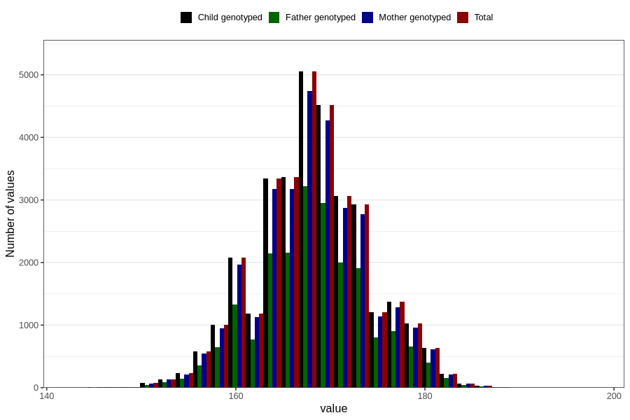

# height_hm
Variable mapping to `HM259` in `HelseModre`.
- Number of values:

| Value | Total | Child genotyped | Mother genotyped | Father genotyped |
| ----- | ----- | --------------- | ---------------- | ---------------- |
| Missing | 48637 | 48637 | 45675 | 32367 |
| Non-missing | 32169 | 32169 | 30349 | 20796 |
| 25th percentile | 164 | 164 | 164 | 164 |
| 50th percentile | 168 | 168 | 168 | 168 |
| 75th percentile | 172 | 172 | 172 | 172 |
| Mean | 168.156703658802 | 168.156703658802 | 168.165738574582 | 168.20393344874 |
| Standard deviation | 5.89535880466252 | 5.89535880466252 | 5.89812443512143 | 5.89638071344276 |
| N | 32169 | 32169 | 30349 | 20796 |

