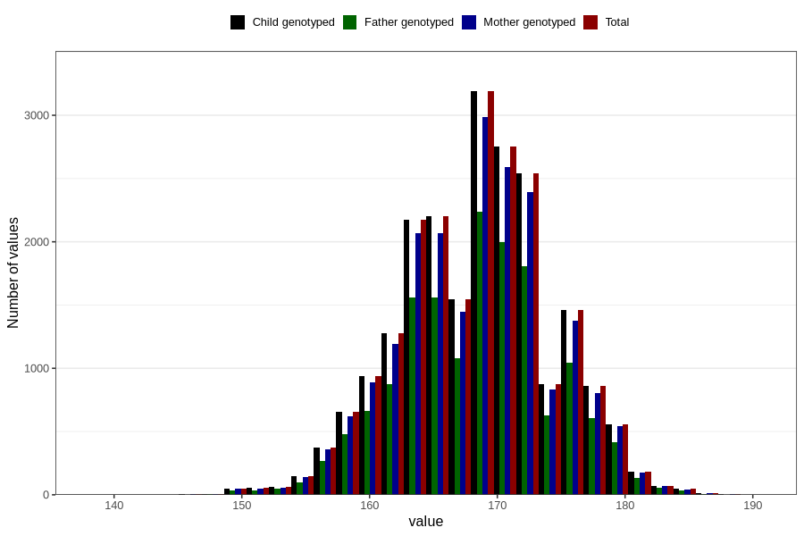

# height_mother_14m
Variable mapping to `UM271` in `Ungdomsskjema_Mor_v12_standard`.
- Number of values:

| Value | Total | Child genotyped | Mother genotyped | Father genotyped |
| ----- | ----- | --------------- | ---------------- | ---------------- |
| Missing | 58760 | 58760 | 55259 | 37501 |
| Non-missing | 22046 | 22046 | 20765 | 15662 |
| 25th percentile | 164 | 164 | 164 | 164 |
| 50th percentile | 168 | 168 | 168 | 168 |
| 75th percentile | 172 | 172 | 172 | 172 |
| Mean | 168.266851129457 | 168.266851129457 | 168.272718516735 | 168.312539905504 |
| Standard deviation | 5.87694603184053 | 5.87694603184053 | 5.88952504463506 | 5.87622755367751 |
| N | 22046 | 22046 | 20765 | 15662 |

