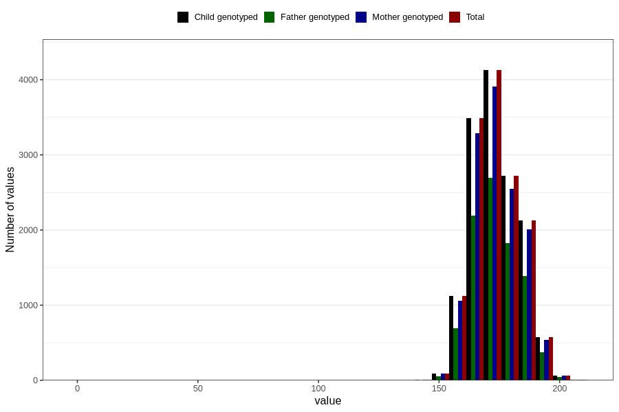

# height_ung
Variable mapping to `UH51` in `UngHelse_standard`.
- Number of values:

| Value | Total | Child genotyped | Mother genotyped | Father genotyped |
| ----- | ----- | --------------- | ---------------- | ---------------- |
| Missing | 66471 | 66471 | 62504 | 43884 |
| Non-missing | 14335 | 14335 | 13520 | 9279 |
| 25th percentile | 167 | 167 | 167 | 167 |
| 50th percentile | 173 | 173 | 173 | 173 |
| 75th percentile | 180 | 180 | 180 | 180 |
| Mean | 173.472619462853 | 173.472619462853 | 173.47625739645 | 173.64414268779 |
| Standard deviation | 9.96632744055587 | 9.96632744055587 | 9.83832009268063 | 10.0689954324478 |
| N | 14335 | 14335 | 13520 | 9279 |

