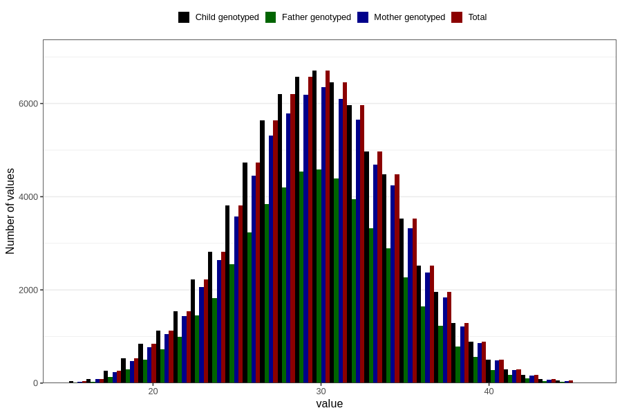

# mother_age_15w
Variable mapping to `MOR_ALDERUTFYLT_S1` in `Skjema1_v12`.
- Number of values:

| Value | Total | Child genotyped | Mother genotyped | Father genotyped |
| ----- | ----- | --------------- | ---------------- | ---------------- |
| Missing | 4504 | 4504 | 4197 | 2509 |
| Non-missing | 76302 | 76302 | 71827 | 50654 |
| 25th percentile | 27 | 27 | 27 | 27 |
| 50th percentile | 30 | 30 | 30 | 30 |
| 75th percentile | 33 | 33 | 33 | 33 |
| Mean | 29.7466121464706 | 29.7466121464706 | 29.7687638353265 | 29.7150669246259 |
| Standard deviation | 4.53700730862749 | 4.53700730862749 | 4.52612005976196 | 4.41939539212207 |
| N | 76302 | 76302 | 71827 | 50654 |

