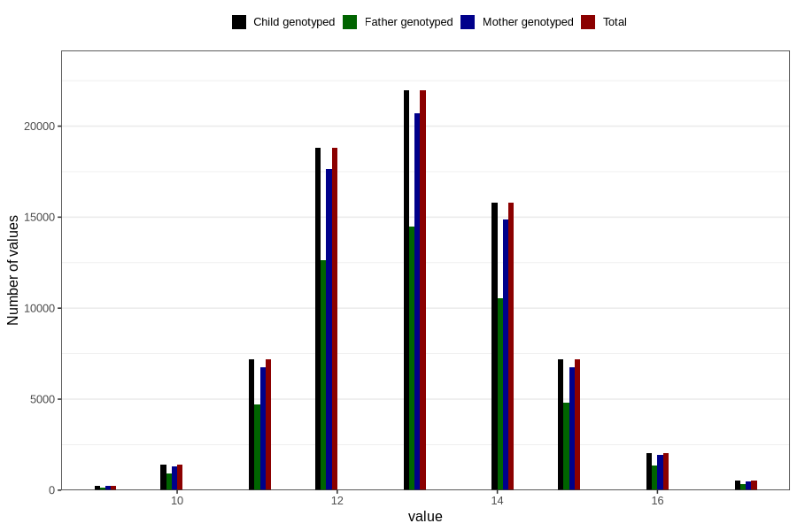

# mother_age_at_menarche
Variable mapping to `AA12` in `Skjema1_v12`.
- Number of values:

| Value | Total | Child genotyped | Mother genotyped | Father genotyped |
| ----- | ----- | --------------- | ---------------- | ---------------- |
| Missing | 5691 | 5691 | 5320 | 3295 |
| Non-missing | 75115 | 75115 | 70704 | 49868 |
| 9 | 227 | 227 | 217 | 150 |
| 10 | 1408 | 1408 | 1327 | 925 |
| 11 | 7167 | 7167 | 6730 | 4701 |
| 12 | 18820 | 18820 | 17652 | 12617 |
| 13 | 21957 | 21957 | 20712 | 14469 |
| 14 | 15781 | 15781 | 14864 | 10530 |
| 15 | 7172 | 7172 | 6769 | 4784 |
| 16 | 2058 | 2058 | 1938 | 1350 |
| 17 | 525 | 525 | 495 | 342 |

