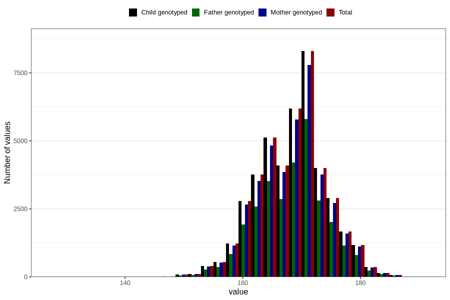

# mother_height_3y
Variable mapping to `GG502` in `Skjema6_3aar_v12`.
- Number of values:

| Value | Total | Child genotyped | Mother genotyped | Father genotyped |
| ----- | ----- | --------------- | ---------------- | ---------------- |
| Missing | 37788 | 37788 | 35558 | 23431 |
| Non-missing | 43018 | 43018 | 40466 | 29732 |
| 25th percentile | 164 | 164 | 164 | 164 |
| 50th percentile | 168 | 168 | 168 | 168 |
| 75th percentile | 172 | 172 | 172 | 172 |
| Mean | 168.349388628016 | 168.349388628016 | 168.346760243167 | 168.373066056774 |
| Standard deviation | 5.85227535508532 | 5.85227535508532 | 5.86653372723311 | 5.83388133640482 |
| N | 43018 | 43018 | 40466 | 29732 |

