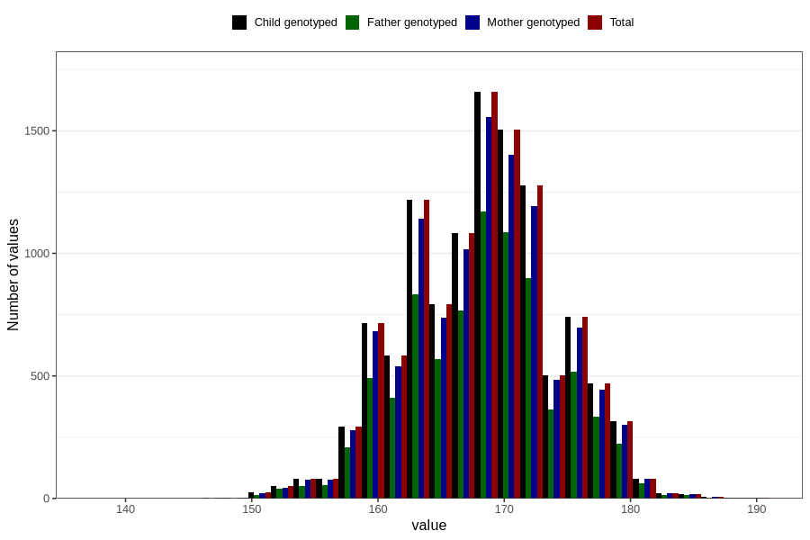

# mother_height_5y
Variable mapping to `LL338` in `Skjema5aar_v12`.
- Number of values:

| Value | Total | Child genotyped | Mother genotyped | Father genotyped |
| ----- | ----- | --------------- | ---------------- | ---------------- |
| Missing | 69273 | 69273 | 65192 | 45030 |
| Non-missing | 11533 | 11533 | 10832 | 8133 |
| 25th percentile | 164 | 164 | 164 | 164 |
| 50th percentile | 168 | 168 | 168 | 168 |
| 75th percentile | 172 | 172 | 172 | 172 |
| Mean | 168.266886326194 | 168.266886326194 | 168.289512555391 | 168.326570761097 |
| Standard deviation | 5.85806306463418 | 5.85806306463418 | 5.87570207393363 | 5.84176732310274 |
| N | 11533 | 11533 | 10832 | 8133 |

