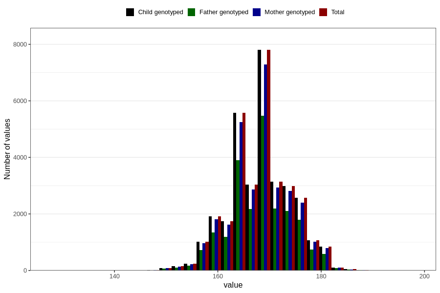

# mother_height_8y
Variable mapping to `NN283` in `Skjema8aar_v12`.
- Number of values:

| Value | Total | Child genotyped | Mother genotyped | Father genotyped |
| ----- | ----- | --------------- | ---------------- | ---------------- |
| Missing | 48449 | 48449 | 45647 | 30490 |
| Non-missing | 32357 | 32357 | 30377 | 22673 |
| 25th percentile | 164 | 164 | 164 | 164 |
| 50th percentile | 168 | 168 | 168 | 168 |
| 75th percentile | 172 | 172 | 172 | 172 |
| Mean | 168.282380937664 | 168.282380937664 | 168.283833163249 | 168.283067966304 |
| Standard deviation | 5.86251727776857 | 5.86251727776857 | 5.87442327190825 | 5.85477351173283 |
| N | 32357 | 32357 | 30377 | 22673 |

